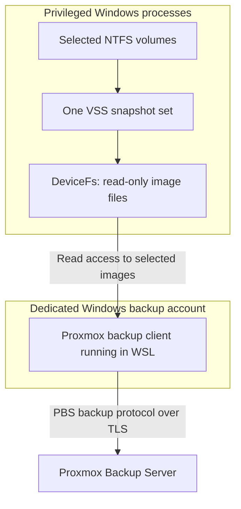

# DeviceFs

DeviceFs brings Windows volume-image backups to Proxmox Backup Server (PBS). It
combines consistent Windows snapshots, a read-only virtual filesystem, and
Proxmox's GNU/Linux backup client into an integrated backup and
selective-recovery system. It runs on both x64 and ARM64 Windows.

The central idea is to expose a snapshot of a Windows volume as an ordinary
file, then let the official PBS client read that file. DeviceFs supplies the
image's bytes as they are requested, directly from the snapshot. Upload can
therefore begin from the snapshot itself, while PBS supplies chunk
deduplication, encrypted storage, and individually selectable recovery points.

That same idea works in the other direction. DeviceFs can present an image
stored on PBS as a read-only Windows volume. An administrator can browse it and
copy selected files using familiar Windows tools, with the required image data
retrieved only when it is read.

The Windows supervisor prepares the dedicated backup account, GNU/Linux execution
environment, and Windows service as part of installation. It can replace that
GNU/Linux environment when a new image is published, while backup configuration
and credentials remain centrally managed under Windows ProgramData.

## Getting started

With [WinFsp](https://winfsp.dev/) installed, these steps prepare the machine
and set up regular backups:

1. **Install from an elevated PowerShell window.** Run the supervisor from the
   directory containing it:

   ```powershell
   .\backup-supervisor.exe --install
   ```

   If installation requests a restart, restart Windows and run the same command
   again to complete setup.

2. **Fill in the generated configuration.** Open
   `C:\ProgramData\devicefs\credentials\backup.json` in an elevated editor and
   enter the PBS connection details, authentication credentials, and encryption
   settings. Check the selected `volumes`; the default is `["C:"]`.

3. **Test the configuration and credentials with a foreground backup.** In the
   elevated PowerShell window, run:

   ```powershell
   & 'C:\Program Files\devicefs\backup-supervisor.exe' --foreground
   ```

   This performs a backup and displays its progress and any errors in the
   console. Press **Ctrl+C** to cancel the test and let the backup wind down
   safely.

4. **Schedule regular service starts.** In Windows Task Scheduler, create a task
   with the desired schedule. Set its action to **Start a program**, use
   `sc.exe` for **Program/script**, and enter `start devicefsbackup` in
   **Add arguments**. Run the task as `SYSTEM` so it can start the service
   without an interactive logon.

Each scheduled start runs one supervised backup. Progress and results are
recorded under `C:\ProgramData\devicefs\logs`. The service can be stopped with
`sc.exe stop devicefsbackup` to request cancellation and cleanup.

## What a backup preserves

The normal backup workflow captures NTFS volume images. These images retain the
allocated contents of the volume together with the filesystem structures that
describe them: directories, file names, security descriptors, alternate data
streams, and the relationships between files and their storage. Windows can
later interpret those structures through its own filesystem implementation.

This is useful when the recovery object is a volume, including its filesystem
metadata. Reading the volume in blocks also avoids the per-file traversal and
open operations that can dominate backups of large directory trees.

Before those reads begin, DeviceFs asks the Windows Volume Shadow Copy Service
(VSS) to create a snapshot set containing the selected volumes. VSS writers
participate by default. Applications with participating writers can prepare
their data for the snapshot, giving the backup an application-consistent view.
Applications resume their work after snapshot creation while the potentially
much longer upload reads the stable snapshots. A writerless mode is also
available for workloads that call for it.

Multiple volumes belong to one coordinated snapshot set and one PBS backup
snapshot. Each image has a stable name based on its volume GUID. A DeviceFs
manifest accompanies the images and records the exact VSS set and member
identifiers, together with volume labels and mount points that help an
administrator recognize the contents. That association gives both people and
later tooling a precise answer to which Windows snapshot produced each image.

## Connecting Windows snapshots to PBS

The backup path has two Windows security identities. The privileged side owns
VSS and the snapshot-device handles. The dedicated backup account owns the WSL
processes and the PBS connection. The image files form the interface between
them.



[WinFsp](https://winfsp.dev/) provides the Windows filesystem integration.
DeviceFs implements the small filesystem that sits above it: each selected
block device appears as a file with a length and ordinary positional reads.
The source device remains open inside the DeviceFs process, which translates
file reads into the corresponding device reads. Alignment handling, caching,
and the treatment of free space belong in this one implementation.

The virtual filesystem is also useful independently of the backup supervisor.
It can publish block devices at a drive letter, a directory, or a WinFsp network
prefix, making their contents available to other programs through ordinary file
reads.

This adaptation lets the GNU/Linux backup client consume Windows snapshots through
its existing image-backup interface. A multi-terabyte source can be presented
immediately as a multi-terabyte logical file; the host's staging requirement
comes from snapshot storage, buffers, and working files rather than another
complete copy of that image. Upload can proceed while DeviceFs supplies the
requested ranges.

The PBS protocol, chunk formats, encryption, and archive operations remain in
Proxmox's client code. DeviceFs concentrates on Windows snapshots, access
control, process management, and the block-device bridge. This division makes
protocol compatibility and improvements to the client useful to the Windows
backup path as well.

The supplied GNU/Linux environment builds a Proxmox client with an image-mapping
extension used by selective recovery. Its source and build inputs are recorded
in the [Containerfile](src/wsl/Containerfile). The extension exposes image reads
to the recovery bridge while retaining the client's PBS storage and encryption
machinery.

## Efficiency at the source, over the network, and in storage

Several different kinds of work contribute to a volume backup. DeviceFs treats
source reads, local staging, network transfer, and server storage as separate
costs, and reduces each where the available information permits it.

### Free space becomes predictable zeroes

An NTFS allocation bitmap identifies which clusters are allocated and which
are free. DeviceFs reads that bitmap from the snapshot being backed
up, so the allocation information and the image bytes describe the same point
in time.

When an image read covers only free clusters, DeviceFs can return zeroes
directly. When a read covers both allocated and free clusters, it preserves the
allocated bytes and substitutes zeroes in the free portions. The volume keeps
its original logical size and layout, while free space has a stable, predictable
representation.

This saves physical reads for wholly free ranges and makes those ranges easy
to deduplicate. It also avoids carrying arbitrary remnants of deleted data
from unallocated clusters into the backup. A mostly empty volume can therefore
be represented efficiently even though its logical image still spans the full
volume address space.

### Each PBS snapshot describes a complete recovery point

PBS divides image data into chunks and records an index describing the chunks
needed to reconstruct the image. Chunks already available to the backup can be
referenced again, so later backups can transfer substantially less data than
the logical size of their images. The datastore shares those chunks across
snapshots. [Proxmox's technical overview](https://pbs.proxmox.com/docs/technical-overview.html#snapshots)
describes this relationship between indexes, chunks, and upload completion.

For recovery, the administrator selects a finished snapshot. Its indexes
describe the complete image at that point in time, and PBS resolves the
referenced chunks from the datastore. This combines incremental transfer and
shared storage with a straightforward choice of recovery point. See also
[Proxmox's explanation of incremental and full backups](https://pbs.proxmox.com/docs/faq.html#is-the-backup-incremental-deduplicated-full).

Because these are ordinary PBS image archives, the backups fit the datastore's
existing administration: namespaces, access controls, retention, verification,
and synchronization can be managed alongside other PBS backups.

### The read path stays direct

DeviceFs serves reads on demand and enables caching for normal backups. The PBS
client can upload multiple images in parallel, which is enabled in the default
configuration. Those mechanisms help make use of the source storage and
network while keeping image production tied to the client's actual reads.

The installer selects WSL1 for its efficient access to the Windows-hosted image
files. The backup path also supports WSL2. The same Windows implementation
serves x64 and ARM64, with the matching GNU/Linux image selected during installation.

Today, the client scans the logical images to determine their chunk sequences.
Free-space synthesis reduces the backing-device work, and PBS deduplication
reduces transfer and storage. Further work on VSS change information addresses
the remaining cost of rereading allocated data that has stayed unchanged.

## Recovering files through Windows

A volume-image backup is especially useful when it can be inspected with the
same filesystem tools that normally read the volume. DeviceFs's selective-view
operation makes a completed PBS image available as a read-only volume mounted
in a Windows directory. The supervisor prints the location and keeps the
viewing session alive while the administrator browses or copies files.

The recovery path begins in the PBS client, which maps the selected archive
and supplies its image data. A small Samba DCE/RPC helper makes positional
reads available to DeviceFs. DeviceFs then synthesizes the surrounding VHDX
and partition structures needed for Windows to attach that volume. Reads of
the VHDX's payload resolve to reads of the backed-up image.

Consequently, a generated VHDX can describe a large backup while its data
continues to live in PBS. Opening a directory or copying a file causes Windows
to request the filesystem metadata and content needed for that operation.
The existing Windows filesystem implementation handles the backed-up layout,
and familiar tools can consume the resulting view.

The bridge has a narrow interface: obtain the image length and read a range of
bytes. The same block-device abstraction serves local snapshots and remotely
mapped images, so the Windows filesystem and VHDX code can be reused across
backup, recovery, and diagnostic work. Each viewing session receives a freshly
generated credential for the Samba endpoint, whose connection address defaults
to the local machine's loopback interface. The mounted Windows view is
read-only.

The supervisor owns the whole session, including mapping readiness, the image
server, the virtual filesystem, attachment, and unmounting. Ending the session
releases these resources in the order their dependencies require. Complete
image extraction is also available through PBS's image-restore tools.

## Security through separation of authority

### A privileged Windows identity is used only for operations that require it

Creating VSS snapshots and opening raw snapshot devices require substantial
Windows authority. In service mode, the supervisor and DeviceFs perform that
work as LocalSystem. The network-facing PBS client runs under the dedicated
internal Windows account, which installation creates as an ordinary local
user.

The distinction matters because a backup client processes server responses,
handles credentials, and implements a substantial network protocol. Its
Windows authority should match the job it performs. DeviceFs grants that
account read access to the selected snapshot images, giving the uploader the
data it needs through a constrained filesystem interface.

The raw device handles remain owned by the privileged DeviceFs process. The
published filesystem is read-only, its mutation operations are rejected, and
its access-control entries identify the Windows accounts permitted to use it.
The service's cross-account process launch also restricts inherited handles to
the intended standard streams. Together, these choices keep access to backup
data separate from authority over raw devices and VSS administration.

The backup account is intentionally trusted with the data and secrets delivered
to its processes. Its configured Windows and PBS permissions determine what
those processes can access. A dedicated, nonadministrative account and a PBS
credential scoped to the required datastore operations make that trust
relationship explicit. WSL provides GNU/Linux execution within this account; the
Windows account and the read-only publication interface enforce the privilege
separation.

### A separate less-privileged internal Windows account is managed by DeviceFs

DeviceFs manages the internal Windows account's password itself. Account
creation and password-based launches use a password generated from 256 bits of
system-provided cryptographic randomness. Before a privileged interactive
caller logs on as the backup account, the supervisor replaces the account's
password and keeps the new value in memory only for the duration of the logon
operation.

The password-reset function checks the target account's administrator status
before making a change. This protects an administrator who accidentally names
their own account in the configuration. The LocalSystem service has its own
token-based logon path for the same internal identity.

Configuration and credentials live in a protected directory under ProgramData,
with access reserved for SYSTEM and Administrators when installation creates
them. The backup account receives the values needed for each operation through
the supervisor's process channels. This keeps management of the persistent
configuration in the privileged Windows side of the system.

### End-to-end encryption

DeviceFs uses the PBS client's TLS and certificate-validation facilities for
the server connection, including the configured certificate fingerprint. The
client also supplies AES-256-GCM encryption, allowing image data to be encrypted
before it reaches the datastore. The corresponding key is required for
recovery, so keeping a recoverable copy of that key is part of deploying
encrypted backups. [Proxmox documents the encryption and key-recovery model](https://pbs.proxmox.com/docs/backup-client.html#encryption).

For backup uploads, the supervisor sends the encryption-key document through
standard input to the client's `--keyfd` interface. The authentication secret
is supplied in the narrowly scoped environment expected by the client. Secure
allocator-backed strings are used for secret values where practical, and the
Windows password buffers are cleared when their owners release them. These
choices reduce unnecessary persistence and copies of credentials while making
their required recipients clear.

### Hardened binaries and source code

The first-party Windows executables enable process mitigations that constrain
DLL loading, dynamic code, legacy extension points, and invalid-handle use.
DeviceFs filesystem mode additionally prohibits child-process creation. These
restrictions narrow the actions available to a compromised process according
to the work that process is expected to perform.

The native build treats compiler warnings and enabled static-analysis findings
as errors. Standard-library hardening, security checks, Control Flow Guard, and
the applicable platform control-flow protections are enabled alongside normal
optimization. Resource ownership uses C++ lifetimes and Windows Implementation
Libraries (WIL) handles, keeping release behavior connected to the object that
owns the resource.

This discipline also applies to exceptional code. Analyzer suppressions carry
the language, API, or structural reason that makes the operation valid, so
reviewers can examine the assumption beside the code it affects. Third-party
build settings remain separate from the first-party warning and analysis
policy.

## Reliability

A backup has several meaningful completion points: VSS creates the snapshots,
the client finishes the PBS upload, the GNU/Linux operation releases its mounts,
and DeviceFs shuts down. The supervisor keeps the snapshot owner alive across
that sequence and uses actual operation results to decide whether the run
succeeded.

PBS's completion step establishes that the remote backup has finished. The
DeviceFs manifest is uploaded with the images, so the completed backup carries
the identity of the snapshots that supplied its bytes. After the required local
work also succeeds, DeviceFs retains its VSS set. That retained set provides
exact evidence for later inspection and for the change-tracking work described
below.

On failure or cancellation, snapshot cleanup targets the exact set created by
the current operation. This keeps DeviceFs's resource ownership compatible
with other software using VSS on the same machine. If cleanup itself encounters
a problem, the diagnostic preserves the original failure and reports the
additional problem in its own context.

The backup operation handles cancellation by first requesting graceful
termination of the GNU/Linux processes, followed by forced termination if their
grace period expires. Service operation adds a separate supervisor process
around the backup. It monitors the backup process and its Windows process job,
captures output in persistent logs, and handles service stop and Windows
preshutdown requests.

This outer supervisor can enforce a shutdown deadline even if the backup
process becomes unresponsive. It also checks for processes left in the job
after the backup process exits, records diagnostics when forced cleanup is
needed, and terminates those remaining processes. These facilities make the
demand-start service the normal way to run unattended backups.

Installation and real backups acquire the same exclusive backup lock. An
installation attempt therefore respects an active backup, and a backup cannot
start while installation is modifying the environment it would use. Progress
and failure messages identify the operation being performed; foreground output
is visible in the console, and service operation has persistent logs.

## Installation prepares a complete backup environment

The `--install` command places the supervisor in Program Files, creates the
initial configuration when needed, prepares the internal Windows account,
installs a suitable WSL package, enables the Windows component needed for WSL1, and
materializes the GNU/Linux distribution under the internal account. It also
creates or updates the Windows service. The administrator supplies the PBS
server, datastore, authentication, and encryption settings in the generated
configuration.

WSL package installation and Windows component readiness are checked separately.
The package supplies the executable and its features; the component supplies
WSL1 support. If Windows reports that either preparation step needs a restart,
the installer explains that the administrator should restart and run the same
installation command again. Completed preparation remains available for that
next invocation.

The same command handles later updates. An existing configuration is preserved,
and invoking the supervisor from its installed location skips the unnecessary
binary copy while still performing environment preparation. Downloads report
progress, and the materialization process runs under the backup account with
its output forwarded to the installing administrator's console.

The installed program and persistent state use the standard Windows locations:

| Location | Purpose |
| --- | --- |
| `C:\Program Files\devicefs` | Installed supervisor executable |
| `C:\ProgramData\devicefs\credentials\backup.json` | Protected configuration and PBS credentials |
| `C:\ProgramData\devicefs\logs` | Service logs |
| `C:\ProgramData\devicefs\wsl` | Materialized GNU/Linux distributions |

The table shows the conventional locations; Windows known-folder lookup
accommodates installations on other drives. Each distribution directory
includes its recognizable name and a unique identifier, such as `Debian-<GUID>`.
Administrators can therefore see which runtime images occupy the program's
state directory.

The WSL parent directory grants creation access to the configured backup
account while reserving full control for Administrators and SYSTEM. Its grants
are non-inheritable, allowing each imported distribution to receive its own
permissions. Installation reapplies the parent's grants if the configured
account changes. Before importing, the materializer sets its token's default
permissions so newly created objects belong to the backup user and grant full
control to that user, SYSTEM, and Administrators.

## A replaceable GNU/Linux environment, distributed as an OCI image

The GNU/Linux environment is built from the repository's
[Containerfile](src/wsl/Containerfile) and published as the multi-architecture
OCI image `ghcr.io/cathyjf/devicefs-wsl:latest`. Installation selects the root
filesystem for the machine's native architecture and imports it into WSL. OCI
provides the build and distribution format, and WSL provides execution on the
installed machine.

This brings the useful packaging properties of container images to a WSL
deployment. The client, helper programs, libraries, GNU/Linux account, and runtime
configuration arrive as one assembled filesystem. Build stages prepare the
executables and their dependencies; the final Debian-based runtime contains
the programs needed to operate them. Source-revision records accompany the
built executables so their provenance can be inspected.

The GNU/Linux orchestration program is embedded in the Windows supervisor and sent
to Fish when an operation starts. Its command and input protocol therefore
travel with the supervisor that produces them. The OCI filesystem supplies
the runtime tools, while the Windows installation owns the operation logic
and persistent backup configuration.

Treating the distribution as a replaceable runtime image makes upgrades
straightforward. After importing, DeviceFs records the OCI layer digest beside
the distribution's root filesystem. A later installation compares that digest
with the architecture-appropriate layer published in GHCR. A match avoids
another large download and import.

When the layer changes, DeviceFs fully imports a replacement into a new
directory under a temporary distribution name. It then moves the old
registration to another temporary name, gives the replacement the canonical
name, and unregisters the old distribution. Most of the work is complete before
the short name-switching step begins, and persistent configuration remains in
its existing ProgramData location.

The two registry name changes are sequential. An interruption in that interval
can leave temporary distributions for the administrator to remove; rerunning
installation can materialize a fresh canonical distribution when needed. The
normal successful path removes the old runtime. A supplied local OCI archive
can also be deployed explicitly, which always installs the supplied image.

## Working with the installed system

The generated configuration groups the selected `volumes`, the `pbs`
connection and encryption settings, and the `internal_windows_account` with
its WSL configuration. Defaults select `C:`, the account
`devicefs-backup-user`, and a distribution named `Debian`. The template keeps
advanced runtime-path settings implicit, leaving the values an administrator
normally needs to configure prominent.

The [getting-started steps](#getting-started) configure Task Scheduler to start
the demand-start service. Each service start performs one backup and then stops.
Task Scheduler determines when to begin, while the service owns supervision of
the backup and records its output and final result in the service log.

Scheduling only the service-start command is deliberate. Task Scheduler's
[task termination mechanism](https://learn.microsoft.com/en-us/windows/win32/api/taskschd/nf-taskschd-itasksettings-put_allowhardterminate)
can forcibly terminate a program it launches, cutting off that program's
cleanup. The short service-start command requests the start and then exits,
leaving the backup's lifetime under the service's supervision.

A running backup can be interrupted safely by stopping the service, for example
with `sc.exe stop devicefsbackup`. The service requests cancellation so the backup
can unmount its filesystems and clean up its snapshot set, and supervises that
shutdown through completion.

Foreground mode is mainly for testing configuration and observing a backup
directly in an elevated console. Its options can select different volumes or a
PBS namespace for that test run. The supervisor also provides modes for
inspecting the committed manifest, opening a selective view, and running
verification diagnostics.
Invoking it with no arguments displays the command syntax.

Backup and selective-view operations use the same configured internal account
and GNU/Linux environment. This keeps the credentials, image tools, and account
permissions consistent across creating a backup and reading it back.

## Further reducing local reads

The next performance step is to use VSS change information to identify which
parts of an image need to be read again. This complements the transfer and
storage savings already supplied by PBS. The current production backup uses
the complete-image scan described above; change-map computation and its
verification tools are being developed alongside it.

The design associates a successful PBS backup with exact retained VSS snapshot
identifiers in the committed DeviceFs manifest. That gives a future backup a
specific baseline whose continued availability can be checked against live VSS
properties, including the original volumes. This remains meaningful even when
other software creates snapshots between DeviceFs runs.

The proposed map combines VSS changed-block evidence with allocation changes
and the relevant System Volume Information extents. These sources describe
different reasons an image range may need to change. The intended policy is
conservative: complete, consistent evidence permits a smaller read set, while
incomplete evidence selects a full scan of the new snapshot.

The repository includes diagnostics for inspecting provider descriptors,
measuring candidate maps, comparing snapshot bytes, and verifying a synthetic
backup through Windows filesystem access. These tools make the optimization
testable at both the block level and the level of files an administrator would
eventually recover.

## Development and licensing

The Windows implementation uses C++23 modules, the Windows SDK, WIL, WinFsp,
and Microsoft's VShadow sample. The project's
[CMake configuration](CMakeLists.txt) and [presets](CMakePresets.json) define
the x64 and ARM64 builds, supported MSVC toolchain, static analysis, and security
settings. Building the Windows supervisor also uses the DISM development
headers and libraries supplied by the Windows ADK Deployment Tools.

The [Samba RPC helper](src/samba_rpc) has its own CMake build for GNU/Linux and macOS.
The [OCI build](src/wsl/Containerfile) assembles the GNU/Linux runtime, and the
[publication script](src/wsl/push-image.fish) publishes its architecture-specific
images together.

DeviceFs is licensed under the [GNU General Public License, version 3 or
later](LICENSE.txt). It builds on the work of the Proxmox, WinFsp, Microsoft WIL,
Samba, and Debian projects, bringing their capabilities together around a
Windows snapshot and recovery workflow.
